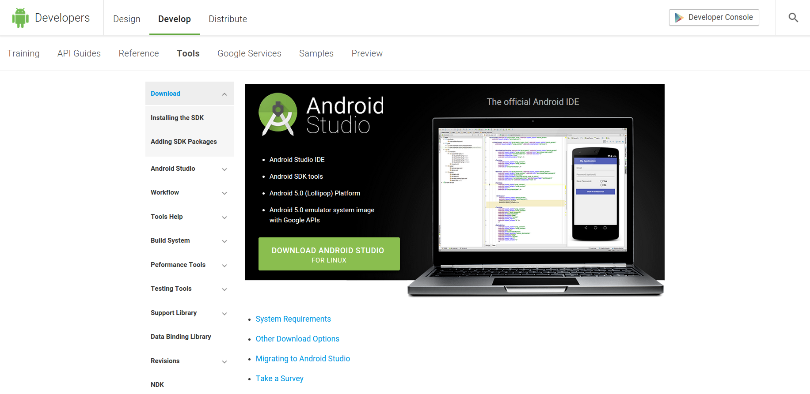
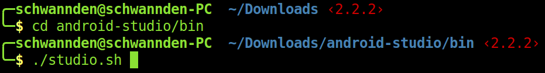

# Installation guide for Android Studio

### Notice the following insrtuctions have only been verified in **Ubuntu 14.04 LTE**

#### Install Java

```
sudo add-apt-repository -y ppa:webupd8team/java
sudo apt-get update
sudo apt-get install oracle-java7-installer oracle-java7-set-default
```

#### Install Android Studio 
1. Download Android Studio [here](http://developer.android.com/sdk/index.html)


2. Unzip the downloaded image


3. Execute studio.sh, a GUI installation window should appear. Follow alone the instructions, select everything as default, your installation should be successful


#### Runnung Emulation
If you simply want to test your app on the phone, this step can be ommited.
Runnung the android emulator requires qemu and CPU support.
1. Install qemu

``apt-get install qemu-kvm qemu``

2. Go to the bios of you CPU (press ether F2, F10, or Del at boot time), and turn on the virtualization support.

